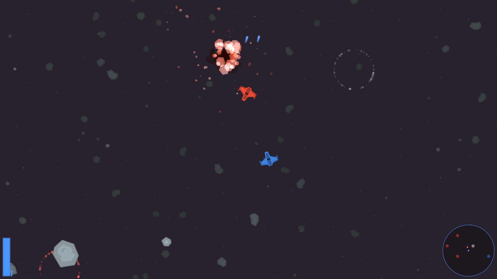

# Game Jam Entry: "Spaceshooter Thing"

Experimenting with a team-based gameplay in a top-down dual stick space shooter. Your goal is to destroy enemy ships and capture spawnpoints - though the capture logic didn't make it into the game for time reasons. Except for assets, the game was made in 8 hours.

## Screenshots

_Click for animated version._

## Running it

**This game requires a gamepad to be played**, no other input methods are supported. It will always use your first gamepad, if you have multiple gamepads plugged in. Controls are:

- `Left thumbstick`: Move
- `Right thumbstick`: Aim
- `Right trigger`: Fire
- `Start`: Restart map
- `Back`: End game

Your viewport will be bigger or smaller depending on your screen resolution - a bigger screen is an advantage, but not a requirement.

### The Dev Way

- Clone or download the repository.
- Run `DualityEditor.exe`, let it grab some binaries it needs.
- Close it and run `DualityLauncher.exe`

### The Shortcut

- Download the [binary package](https://github.com/ilexp/bmj2017-12/raw/master/Download.zip)
- Extract and run `DualityLauncher.exe`

## Attribution

Graphics assets used are from [Kenney](https://kenney.nl/), audio is partially recycled from an older project of mine, and partially taken from the old Freespace games.
